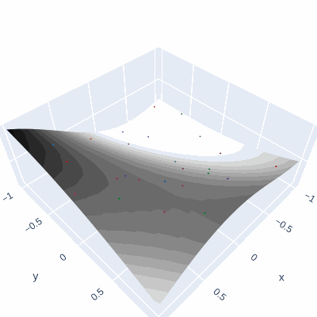

# Diffusion Visualization 
Some code to visualize the forward and reverse diffusion process in [presentations](https://github.com/gfloto/presentations) I've given. Here, we plot a surface intended to represent the underlying data distribution, in accordance with the manifold hypothesis for images.

Plot representing the forward and reverse process are visualized. The intention here is to include these in presentations to aid in the explanation of the diffusion process.

## Forward Process
```python
python forward_process.py
```

is used to generate the following plot. A dataset of points lies on the data manifold (by definition). We then visualize the noising schedule where the radius of each sphere corresponds to the standard deviation of the Gaussian noise applied to each point at that instant in time.

In summary, we can see that the center of the spheres all converge to the origin, and the standard deviation of the noise increases to a maximum value of 1. At this point in time, the data points become indistinguishable from one another.

<p align="center">
	
</p>

## REVERSE PROCESS
```python
python rev_process.py
```

is used to generate the following plot. Here, we visualize the reverse process, where the data points are projected back onto the manifold. In this case, we consider a sample from an [OU-Process](https://en.wikipedia.org/wiki/Ornstein%E2%80%93Uhlenbeck_process), that is the reversal of the noising / forward process.

For visualization purposes, we plot an image that is de-noised according to the default schedule in the [DDPM](https://arxiv.org/abs/2006.11239) paper.

<p align="center">
	
</p>

## Requirements
See `requirements.txt` for a list of required packages.

```bash
pip install -r requirements.txt
```
